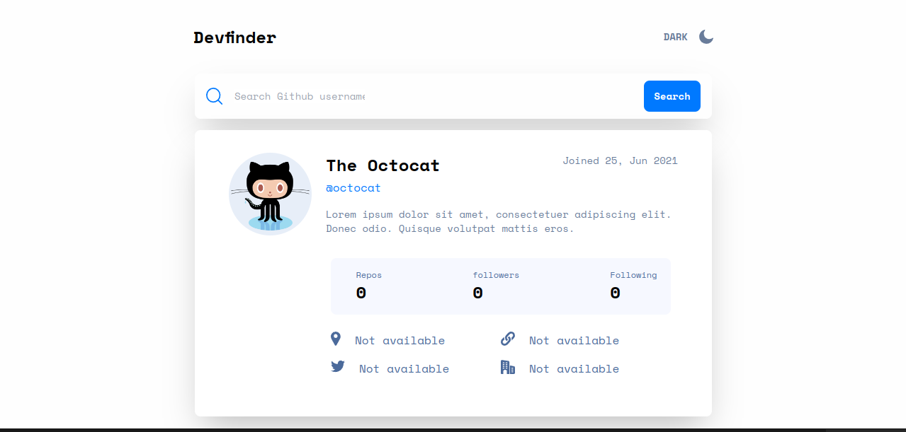

# Frontend Mentor - GitHub user search app solution

This is a solution to the [GitHub user search app challenge on Frontend Mentor](https://www.frontendmentor.io/challenges/github-user-search-app-Q09YOgaH6). Frontend Mentor challenges help you improve your coding skills by building realistic projects. 

## Table of contents

- [Overview](#overview)
  - [The challenge](#the-challenge)
  - [Screenshot](#screenshot)
  - [Links](#links)
- [My process](#my-process)
  - [Built with](#built-with)
  - [Useful resources](#useful-resources)
- [Author](#author)
- [Acknowledgments](#acknowledgments)

## Overview

### The challenge

Users should be able to:

- View the optimal layout for the app depending on their device's screen size
- See hover states for all interactive elements on the page
- Search for GitHub users by their username
- See relevant user information based on their search
- Switch between light and dark themes
- **Bonus**: Have the correct color scheme chosen for them based on their computer preferences. _Hint_: Research `prefers-color-scheme` in CSS.

### Screenshot

### Links

- Solution URL: [Github Repository](https://github.com/alfonso-ramos/github-user-search)
- Live Site URL: [Live site URL here](https://github-users-search-rts.netlify.app/)

## My process

### Built with

- Semantic HTML5 markup
- CSS custom properties
- Flexbox
- CSS Grid
- Mobile-first workflow
- [React](https://reactjs.org/) - JS library
- [Tailwind](https://tailwindcss.com/) - CSS framework

### Useful resources

- [Octokit core.js](https://github.com/octokit/core.js#readme) - It is a tool that allowed me to use the Github API without the need to make CLI calls
- [Get a user endpoint in the Github API REST](https://docs.github.com/en/rest/users/users?apiVersion=2022-11-28#get-a-user) - The documentation can be very overwhelming the first time, this is the exact endpoint to get a github user

## Author

- Website - [ponchoramos.com](https://www.ponchoramos.com)
- Frontend Mentor - [@alfonso-ramos](https://www.frontendmentor.io/profile/alfonso-ramos)
- Twitter - [@PonchoRamosDev](https://www.twitter.com/PonchoRamosDev)

## Acknowledgments

I recommend that you use your github token from the first moment of using the Github REST API since the API has a greater capacity to be used without restrictions

